# Decision Trees & Selection Guides

**Interactive guides to help you make the right choices.**

---

## Quick Selection

**Answer one question:** What's your primary goal?

- **"I want to manage my computer/servers more easily"** → [Luminous Nix](#luminous-nix-decision-tree)
- **"I want to invest in renewable energy with impact"** → [Terra Lumina](#terra-lumina-decision-tree)
- **"Both sound interesting!"** → Try both! They complement each other

---

## Luminous Nix Decision Tree

### Is Luminous Nix Right for You?

```mermaid
graph TD
    A[Do you use Linux/Unix systems?] -->|Yes| B[Are you tired of memorizing commands?]
    A -->|No - Windows| C[Wait for Windows support Q4 2026]
    A -->|No - macOS| D[Are you willing to use NixOS in VM?]

    B -->|Yes| E[Can you commit to using NixOS or Nix?]
    B -->|No| F[Do you want voice control?]

    E -->|Yes| G[✅ Luminous Nix is perfect for you!]
    E -->|Not sure| H[Try in VM first]

    F -->|Yes| G
    F -->|No| I[Maybe stick with traditional tools]

    D -->|Yes| H
    D -->|No| C

    H --> J[Start here: Quick Start Guide]
    G --> K[Start here: Getting Started]
    I --> L[Check Comparisons page]
```

### Detailed Assessment

**Answer these questions:**

**1. What operating system do you use?**
- ✅ NixOS → **Perfect! Install now:** [Quick Start](luminous-nix/quickstart.md)
- ✅ Linux (Ubuntu, Fedora, Arch, etc.) → **Good fit.** See: [Migration Guide](luminous-nix/migration-guide.md)
- ⚠️ macOS → **Beta support via Nix. Full support Q2 2026.** See: [Migration Guide - macOS](luminous-nix/migration-guide.md#macos-homebrew-users)
- ❌ Windows → **Not yet. WSL2 possible, native Q4 2026.**

**2. What's your experience level?**
- Beginner → Luminous Nix makes Linux EASIER (natural language!)
- Intermediate → Huge productivity boost
- Expert → You'll love the power + convenience

**3. What's your primary use case?**
- Personal desktop/laptop → ✅ Excellent
- Development environment → ✅ Excellent (see [Tutorial 1](tutorials.md#tutorial-1-set-up-a-complete-web-development-environment))
- Small team (3-15) → ✅ Good (see [Deployment - Team](luminous-nix/deployment.md#team-deployment-small-team))
- Enterprise (50+) → ⚠️ Enterprise features coming Q3 2026

**4. How important is each feature?**

| Feature | Essential | Nice-to-have | Don't care |
|---------|-----------|--------------|------------|
| Natural language interface | → Use LN | → Use LN | → Maybe skip |
| Voice control | → Use LN | → Try it | → Not needed |
| Perfect reproducibility | → Use LN | → LN better | → Either works |
| Easy rollback | → Use LN | → LN better | → Either works |
| Maximum speed | → Trad. tools | → Either | → Use LN |
| Hands-free operation | → Use LN | → Try it | → Not needed |

**Legend:** LN = Luminous Nix, Trad. = Traditional tools

**Your result:**
- **4+ "Use LN":** Luminous Nix is perfect for you → [Get Started](luminous-nix/quickstart.md)
- **2-3 "Use LN":** Good fit, try it → [Compare first](luminous-nix/comparisons.md)
- **0-1 "Use LN":** Maybe not worth switching → Stick with current tools

---

### Migration Strategy Decision

**Already decided to use Luminous Nix? Choose your migration approach:**

**Detailed migration strategy selection:**

**Choose "Complete Switch" if:**
- ✅ You're comfortable rebuilding your system
- ✅ You have good backups
- ✅ You want fastest path to full Luminous Nix
- ✅ You're setting up a new machine anyway
- ✅ You love NixOS philosophy

→ [Migration Guide - Complete Switch](luminous-nix/migration-guide.md#strategy-2-complete-switch-advanced)

**Choose "Gradual Migration" if:**
- ✅ You want to minimize disruption
- ✅ You need to stay productive during transition
- ✅ You want to learn incrementally
- ✅ You're not ready to commit fully yet
- ✅ You're migrating a team (different learning speeds)

→ [Migration Guide - Gradual](luminous-nix/migration-guide.md#strategy-1-gradual-migration-recommended)

**Choose "Parallel Learning" if:**
- ✅ You're very cautious about change
- ✅ You want to fully evaluate before committing
- ✅ You have time to experiment
- ✅ You want to keep production system untouched
- ✅ You're evaluating for a team/enterprise

→ [Migration Guide - Parallel](luminous-nix/migration-guide.md#strategy-3-parallel-learning-cautious)

---

## Terra Lumina Decision Tree

### Is Terra Lumina Right for You?

```mermaid
graph TD
    A[Can you commit capital for 10 years?] -->|Yes| B[Do you have $10+ to invest?]
    A -->|No| C[Need liquidity - stick with stocks/bonds]

    B -->|Yes| D[Is direct impact important to you?]
    B -->|No| C

    D -->|Yes| E[Do you want 7-13% returns?]
    D -->|No| F[Consider ESG funds instead]

    E -->|Yes - sounds good| G[Are you comfortable doing project due diligence?]
    E -->|No - want higher| H[Consider stocks instead]

    G -->|Yes| I[✅ Terra Lumina is perfect for you!]
    G -->|Not sure| J[Start with small allocation $10-100]

    I --> K[Start here: Getting Started]
    J --> K
```

**Detailed Assessment:**

**1. Investment timeline**
- Can invest for 10 years? → ✅ Terra Lumina works
- Might need money sooner? → ❌ Use liquid investments (stocks, bonds)
- Not sure? → ⚠️ Only invest funds you can commit

**2. Return expectations**
- Want 7-13% returns? → ✅ Terra Lumina delivers
- Need >13%? → ⚠️ Stocks might be better (higher risk)
- Want <7% (very safe)? → ❌ Bonds are safer

**3. Impact priorities**
- Direct, measurable impact essential? → ✅ Terra Lumina perfect
- Impact nice but not critical? → ⚠️ Either Terra Lumina or ESG
- Don't care about impact? → ❌ Traditional investments simpler

**4. Liquidity needs**
- Don't need to sell for 10 years? → ✅ Perfect
- Might need emergency access? → ⚠️ Hardship redemption available
- Need frequent liquidity? → ❌ Use stocks/ETFs

**5. Due diligence preference**
- Happy to research projects? → ✅ Terra Lumina
- Want fully passive? → ❌ Index funds easier
- Will research with guidance? → ✅ We provide frameworks

**Your score:**
- **4-5 ✅:** Terra Lumina is ideal → [Get Started](terra-lumina/getting-started.md)
- **2-3 ✅:** Good fit, start small → [Compare first](terra-lumina/comparisons.md)
- **0-1 ✅:** Maybe not the best fit → Stick with traditional

---

### Investment Allocation Decision

**Decided to invest? How much to allocate:**

**Allocation by risk tolerance:**

| Portfolio Size | Conservative | Moderate | Aggressive |
|----------------|-------------|----------|------------|
| $10K | 2-5% ($200-500) | 5-10% ($500-1K) | 10-15% ($1-1.5K) |
| $50K | 5-10% ($2.5-5K) | 10-15% ($5-7.5K) | 15-25% ($7.5-12.5K) |
| $250K | 10-15% ($25-37.5K) | 15-25% ($37.5-62.5K) | 25-40% ($62.5-100K) |
| $1M | 10-20% ($100-200K) | 20-30% ($200-300K) | 30-40% ($300-400K) |

**Also consider:**

**Your age:**
- 20s-30s: Can be more aggressive (longer timeline)
- 40s-50s: Moderate allocation
- 60s+: Conservative (but 10-year hold works for retirement income)

**Other investments:**
- Heavy in stocks? Terra Lumina adds uncorrelated asset
- Heavy in bonds? Terra Lumina offers higher yields
- Heavy in REITs? Terra Lumina adds different real asset type

→ See [Portfolio Integration Examples](terra-lumina/migration-from-traditional.md#portfolio-integration-examples)

---

### Migration Strategy Decision

**Coming from traditional investing? Choose your approach:**

**Choose "Gradual Allocation" if:**
- ✅ You want to minimize disruption
- ✅ You can spread sales over time
- ✅ You want to harvest tax losses
- ✅ You're risk-averse about change
- ✅ You want time to learn the platform

→ [Migration Guide - Gradual](terra-lumina/migration-from-traditional.md#strategy-1-gradual-allocation-conservative)

**Choose "Direct Replacement" if:**
- ✅ You've decided on target allocation
- ✅ You're comfortable selling holdings
- ✅ You understand tax implications
- ✅ You want faster deployment
- ✅ You have clear allocation framework

→ [Migration Guide - Direct Replacement](terra-lumina/migration-from-traditional.md#strategy-2-direct-replacement-moderate)

**Choose "New Capital Allocation" if:**
- ✅ You're actively saving/investing
- ✅ You don't want to sell existing holdings
- ✅ You want tax-efficient transition
- ✅ You can be patient building allocation
- ✅ You're early in investing career

→ [Migration Guide - New Capital](terra-lumina/migration-from-traditional.md#strategy-3-new-capital-allocation-aggressive)

**Choose "Dedicated Impact Allocation" if:**
- ✅ You want clear impact/traditional separation
- ✅ You have sufficient capital for diversity
- ✅ You want easy tracking
- ✅ You're committed to impact investing
- ✅ You want 100% of impact bucket in Terra Lumina

→ [Migration Guide - Dedicated](terra-lumina/migration-from-traditional.md#strategy-4-dedicated-impact-allocation-focused)

---

## Quick Decision Matrices

### Product Selection Matrix

| You are... | Choose | Start here |
|-----------|--------|------------|
| Linux user tired of commands | Luminous Nix | [Quick Start](luminous-nix/quickstart.md) |
| Impact investor | Terra Lumina | [Getting Started](terra-lumina/getting-started.md) |
| DevOps engineer | Luminous Nix | [Deployment Guide](luminous-nix/deployment.md) |
| Retirement investor seeking income | Terra Lumina | [Portfolio Optimization](advanced-use-cases.md#use-case-4-sophisticated-portfolio-optimization-for-retirement) |
| Developer wanting better tools | Luminous Nix | [Tutorial 1](tutorials.md) |
| ESG fund investor wanting transparency | Terra Lumina | [Comparisons](terra-lumina/comparisons.md) |
| SysAdmin managing servers | Luminous Nix | [Advanced Use Cases](advanced-use-cases.md) |
| Foundation with endowment | Terra Lumina | [Foundation Portfolio](advanced-use-cases.md#use-case-5-impact-focused-family-foundation-portfolio) |

### Use Both If...

- ✅ You're a developer AND interested in impact investing
- ✅ You want consciousness-first tools across life domains
- ✅ You believe in the philosophy behind both products
- ✅ You want to support the mission comprehensively

**Typical combined user profile:**
- Uses Luminous Nix for work (development, system management)
- Invests via Terra Lumina for financial future + impact
- Embraces consciousness-first computing holistically
- Active in community, contributes to projects

---

## "I'm Still Not Sure" Flowchart

**Still uncertain? Try these:**

1. **Read case studies** - See how real people use it
   - [Case Studies](case-studies.md)

2. **Ask questions** - Join Discord, ask anything
   - [Discord Community](https://discord.gg/luminous)

3. **Start tiny** - Minimal risk, maximum learning
   - Luminous Nix: Install in VM for 1 week
   - Terra Lumina: Invest $10 in one project

4. **Compare alternatives** - Honest evaluation
   - [Luminous Nix Comparisons](luminous-nix/comparisons.md)
   - [Terra Lumina Comparisons](terra-lumina/comparisons.md)

5. **Read philosophy** - Understand the "why"
   - [Consciousness-First Computing](philosophy/consciousness-first.md)

**Remember:**
- Not every tool is for everyone - and that's fine
- We provide honest information to help you decide
- No pressure, no dark patterns, no manipulation
- Choose what serves YOUR consciousness best

---

## Quick Action Paths

### "I'm convinced - let's go!"

**Luminous Nix:**
1. [Read Quick Start](luminous-nix/quickstart.md)
2. Install (15 minutes)
3. [Do Tutorial 1](tutorials.md) (20 minutes)
4. Use daily for 1 week
5. [Migrate fully](luminous-nix/migration-guide.md)

**Terra Lumina:**
1. [Read Getting Started](terra-lumina/getting-started.md)
2. Create account (5 minutes)
3. [Read Investment Guide](terra-lumina/investment-guide.md) (30 minutes)
4. Make first $10-100 investment
5. [Optimize portfolio](terra-lumina/migration-from-traditional.md) over time

### "I want to evaluate carefully"

**Luminous Nix:**
1. [Read Comparisons](luminous-nix/comparisons.md)
2. [Read Migration Guide](luminous-nix/migration-guide.md)
3. Install in VM
4. Try for 1-2 weeks
5. Decide to commit or not

**Terra Lumina:**
1. [Read Comparisons](terra-lumina/comparisons.md)
2. [Read Migration Guide](terra-lumina/migration-from-traditional.md)
3. [Read Case Studies](case-studies.md)
4. Start with $10-50
5. Scale allocation gradually

### "I want to understand the philosophy first"

1. [Read Consciousness-First](philosophy/consciousness-first.md)
2. [Read Sacred Trinity](philosophy/sacred-trinity.md)
3. [Read Technology & Spirit](philosophy/technology-spirit.md)
4. [Read blog posts](blog/index.md)
5. Then evaluate products

---

## Summary Recommendation

**Your situation → Our recommendation:**

| Situation | Luminous Nix | Terra Lumina |
|-----------|--------------|--------------|
| Linux user | ✅ Try it | - |
| Impact investor | - | ✅ Start small |
| Both! | ✅ Install | ✅ Invest $10+ |
| Curious but cautious | ⚠️ VM trial | ⚠️ $10 trial |
| Enterprise evaluating | ⚠️ PoC + roadmap | ⚠️ Foundation/endowment |
| Just learning about us | 📖 Read philosophy | 📖 Read philosophy |

**Legend:**
- ✅ Recommended action
- ⚠️ Conditional recommendation
- 📖 Learn first
- `-` Not applicable

---

## Need Help Deciding?

**We're here to help - no sales pressure:**

- 💬 [Discord Community](https://discord.gg/luminous) - Ask real users
- 📧 [Email](mailto:info@luminousdynamics.org) - Get personalized guidance
- 📖 [Documentation Map](documentation-map.md) - Explore all resources
- 🗣️ [Discussions](community/discussions.md) - Browse existing conversations

**Remember:** The goal is finding what serves YOU best, not convincing you to use our products. Consciousness-first means YOUR consciousness, YOUR choice.

---

*Decide with confidence. We're here to help, not to push.* 💜

[Back to Getting Started](getting-started.md) | [Documentation Map](documentation-map.md)
