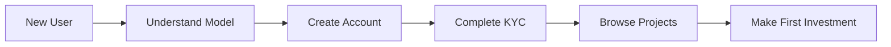
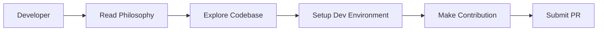
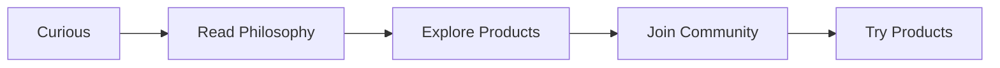

# Getting Started with Luminous Dynamics

Welcome to Luminous Dynamics! This guide will help you understand our ecosystem and get started with our consciousness-first technology.

## What is Luminous Dynamics?

Luminous Dynamics creates **technology that remembers it exists to serve consciousness, not consume it.**

We build tools that:
- ✨ Respect your attention and autonomy
- 🌱 Amplify your capabilities
- 🔓 Enable true sovereignty
- 💚 Serve wellbeing over engagement
- 🌍 Support regenerative systems

## Our Products

### 🖥️ Luminous Nix
**Natural language interface for NixOS system management**

Talk to your computer in plain English (or any language). Install software, configure systems, and manage your environment without memorizing commands.

**Perfect for:**
- Linux users wanting simpler system management
- Developers managing NixOS infrastructure
- Anyone who prefers natural language over terminal commands
- Accessibility needs (full voice control)

**Key Features:**
- Natural language processing with local AI
- Voice interface with customizable wake words
- Safe execution with preview and confirmation
- Works with existing NixOS configuration

→ [Get started with Luminous Nix](#luminous-nix-quick-start)

### 🌞 Terra Lumina
**Renewable energy investment platform**

Invest in solar, wind, and hydro projects starting at just $10. Earn returns while supporting clean energy, then watch ownership transfer to local communities.

**Perfect for:**
- Anyone wanting to invest in renewable energy
- Impact investors seeking competitive returns
- Climate-conscious individuals
- People interested in community ownership models

**Key Features:**
- $10 minimum investment
- 7-13% expected annual returns
- Projects transition to community ownership
- Transparent reporting and project tracking

→ [Get started with Terra Lumina](#terra-lumina-quick-start)

## Choose Your Path

### Path 1: I'm a Linux user interested in Luminous Nix


**15-minute quick start:**

1. **Understand the philosophy** (2 min) → [Consciousness-First Computing](philosophy/consciousness-first.md)
2. **Install Luminous Nix** (5 min) → [Installation Guide](luminous-nix/quickstart.md#installation)
3. **Try your first command** (3 min) → "ask-nix 'install firefox'"
4. **Learn voice control** (5 min) → [Voice Interface](luminous-nix/voice.md)

**Continue learning:**
- [User Guide](luminous-nix/user-guide.md) - Complete feature documentation
- [Advanced Features](luminous-nix/advanced.md) - Power user capabilities
- [Development](luminous-nix/development.md) - Contributing to the project

### Path 2: I'm interested in renewable energy investing



**20-minute quick start:**

1. **Understand the model** (5 min) → [Regenerative Exit Model](terra-lumina/faq.md#what-is-the-regenerative-exit-model)
2. **Create account** (3 min) → [Sign up](https://terralumina.org/signup)
3. **Complete KYC** (5 min) → [Verification](terra-lumina/getting-started.md#kyc-verification)
4. **Browse projects** (5 min) → [Project Discovery](terra-lumina/projects.md)
5. **Make first investment** (2 min) → Start with $10

**Continue learning:**
- [Investment Guide](terra-lumina/investment-guide.md) - Advanced strategies
- [Project Evaluation](terra-lumina/projects.md#evaluation-framework) - How to assess projects
- [FAQ](terra-lumina/faq.md) - Common questions answered

### Path 3: I'm a developer wanting to contribute



**30-minute quick start:**

1. **Understand our values** (5 min) → [Consciousness-First](philosophy/consciousness-first.md)
2. **Review contributing guide** (5 min) → [Contributing](community/contributing.md)
3. **Set up dev environment** (15 min) → [Development Guide](luminous-nix/development.md)
4. **Find an issue** (5 min) → [GitHub Issues](https://github.com/Luminous-Dynamics)

**Development resources:**
- [Sacred Trinity Model](philosophy/sacred-trinity.md) - Our development methodology
- [Code of Conduct](community/code-of-conduct.md) - Community standards
- [API References](luminous-nix/api.md) - Technical documentation

### Path 4: I'm curious about consciousness-first computing



**10-minute exploration:**

1. **Core philosophy** (5 min) → [Consciousness-First Computing](philosophy/consciousness-first.md)
2. **Seven Harmonies** (3 min) → [Guiding Principles](philosophy/seven-harmonies.md)
3. **Join discussion** (2 min) → [Community](community/index.md)

**Deep dives:**
- [Technology & Spirit](philosophy/technology-spirit.md) - Tech as spiritual practice
- [Sacred Trinity](philosophy/sacred-trinity.md) - Human + AI + Local LLM collaboration
- [Seven Harmonies](philosophy/seven-harmonies.md) - Complete framework

---

## Luminous Nix Quick Start

### Prerequisites

- **Operating System:** NixOS 23.05+ or Nix package manager on Linux/macOS
- **Hardware:** Any modern computer
- **AI Backend (choose one):**
  - Local: Ollama with Llama 2 (free, private)
  - Cloud: OpenAI API key (paid, more capable)

### Installation

#### Option 1: NixOS with Flakes (Recommended)

Add to your `configuration.nix`:

```nix
{
  inputs.luminous-nix.url = "github:Luminous-Dynamics/luminous-nix";

  services.luminous-nix = {
    enable = true;
    llmProvider = "ollama";  # or "openai"
  };
}
```

Rebuild your system:
```bash
sudo nixos-rebuild switch
```

#### Option 2: Nix Profile

```bash
nix profile install github:Luminous-Dynamics/luminous-nix
```

#### Option 3: Try without installing

```bash
nix run github:Luminous-Dynamics/luminous-nix -- ask "what version of nix am I running?"
```

### First Steps

**1. Test the installation:**

```bash
luminous-nix --version
# or the shorter alias:
ask-nix --version
```

**2. Try a simple query:**

```bash
ask-nix "what packages are installed?"
```

**3. Install something:**

```bash
ask-nix "install firefox"
# Luminous Nix will:
# - Understand your intent
# - Find the package
# - Show you what it will do
# - Ask for confirmation
# - Execute the installation
```

**4. Configure your system:**

```bash
ask-nix "enable docker and add me to the docker group"
```

**5. Enable voice control (optional):**

```bash
luminous-nix voice --setup
# Then:
luminous-nix voice
# Now speak: "install vim"
```

### Common First Commands

```bash
# Package management
ask-nix "install vim and tmux"
ask-nix "remove firefox"
ask-nix "search for video editors"

# System configuration
ask-nix "enable ssh server"
ask-nix "disable bluetooth"
ask-nix "what services are running?"

# Development environments
ask-nix "set up a python development environment"
ask-nix "install node and npm"

# System information
ask-nix "how much disk space do I have?"
ask-nix "what's my ip address?"
ask-nix "show me system logs"
```

### Next Steps

- **Learn more:** [User Guide](luminous-nix/user-guide.md)
- **Advanced features:** [Advanced Guide](luminous-nix/advanced.md)
- **Voice control:** [Voice Interface](luminous-nix/voice.md)
- **Get help:** [FAQ](luminous-nix/faq.md)

---

## Terra Lumina Quick Start

### Prerequisites

- **Age:** 18+ years old
- **Residency:** Available in most countries (see [supported regions](terra-lumina/faq.md#what-countries-are-supported))
- **Investment:** Minimum $10 USD
- **Verification:** Government-issued ID for KYC

### Sign Up

**1. Create your account:**

Visit [terralumina.org/signup](https://terralumina.org/signup) and provide:
- Email address
- Secure password
- Country of residence

**2. Verify your email:**

Click the link sent to your email.

**3. Complete KYC verification:**

Required for regulatory compliance before investing:
- Upload government-issued ID
- Take a selfie (for identity verification)
- Provide basic information (name, address, date of birth)

⏱️ Verification usually completes in **under 10 minutes**.

### Make Your First Investment

**1. Browse projects:**

Explore renewable energy projects:
- Filter by technology (solar, wind, hydro)
- Filter by location (country, region)
- Sort by return, rating, or funding progress

**2. Evaluate a project:**

Use the [Five Pillar Framework](terra-lumina/projects.md#evaluation-framework):
- ✅ **Financial:** Are returns realistic?
- ✅ **Technical:** Is the technology proven?
- ✅ **Community:** Does the community support it?
- ✅ **Risk:** Are risks understood and mitigated?
- ✅ **Values:** Does it align with consciousness-first values?

**3. Review documentation:**

Each project provides:
- Financial projections and third-party validation
- Technical specifications and equipment details
- Legal agreements and permits
- Environmental impact assessment
- Community benefit plan

**4. Invest:**

- Choose investment amount ($10 minimum)
- Select payment method (credit card, bank transfer, crypto)
- Review and confirm
- Receive ownership tokens on blockchain

**5. Track your investment:**

Monitor through your dashboard:
- Current value and returns
- Project updates and reports
- Upcoming distributions
- Portfolio performance

### Building Your Portfolio

**Start small, diversify gradually:**

**$50 Starter Portfolio:**
```
$20 - Operating solar project (low risk, stable returns)
$20 - Construction wind project (medium risk, higher returns)
$10 - Early-stage hydro project (higher risk, learning opportunity)
```

**$500 Balanced Portfolio:**
```
$200 - 2-3 operating projects (40%)
$200 - 2-3 construction projects (40%)
$100 - 1-2 planning projects (20%)

Spread across:
- 3+ different technologies
- 3+ different countries
- Mix of risk levels
```

**Continue learning:**
- [Investment Guide](terra-lumina/investment-guide.md) - Portfolio strategies
- [Projects Guide](terra-lumina/projects.md) - Finding great projects
- [FAQ](terra-lumina/faq.md) - Common questions

### Next Steps

- **Set up watchlist:** Track projects you're interested in
- **Join community:** [Discord](https://discord.gg/terralumina) for discussions
- **Enable alerts:** Get notified about new projects
- **Read updates:** Stay informed about your investments

---

## Understanding Our Philosophy

### Consciousness-First Computing

Traditional technology is designed to **extract attention and maximize engagement**. We believe technology should **serve consciousness and amplify capability**.

**Five Pillars:**

1. **Respect Attention** - No dark patterns, no manipulation
2. **Amplify Capability** - Enhance what you can do
3. **Maintain Transparency** - Clear about how things work
4. **Enable Sovereignty** - You own and control your data
5. **Serve Wellbeing** - Optimize for human flourishing

→ [Read the full philosophy](philosophy/consciousness-first.md)

### Seven Harmonies

Our operational framework, seven principles that guide every decision:

1. **Intentionality Over Engagement** - Serve user goals, not metrics
2. **Transparency Over Simplicity** - Clear understanding over false ease
3. **Capability Over Dependency** - Teach and empower
4. **Relationship Over Transaction** - Build lasting connections
5. **Regeneration Over Extraction** - Create lasting value
6. **Presence Over Distraction** - Support focused attention
7. **Community Over Consumption** - Collective ownership and benefit

→ [Explore the Seven Harmonies](philosophy/seven-harmonies.md)

### Sacred Trinity Development

Our development methodology: **Human + Claude AI + Local LLM**

- **Conscious:** Human provides vision, values, and judgment
- **Capable:** Claude handles complex reasoning and architecture
- **Sovereign:** Local LLM ensures privacy and ownership

This approach built Luminous Nix for **$200/month** vs. $4.2M traditional cost.

→ [Learn the Sacred Trinity](philosophy/sacred-trinity.md)

---

## Getting Help

### Documentation

- **Luminous Nix:** [User Guide](luminous-nix/user-guide.md) | [FAQ](luminous-nix/faq.md) | [API Reference](luminous-nix/api.md)
- **Terra Lumina:** [Getting Started](terra-lumina/getting-started.md) | [FAQ](terra-lumina/faq.md) | [Investment Guide](terra-lumina/investment-guide.md)
- **Philosophy:** [Consciousness-First](philosophy/consciousness-first.md) | [Seven Harmonies](philosophy/seven-harmonies.md)

### Community

- **Discord:** [discord.gg/luminous](https://discord.gg/luminous) - Active community, real-time help
- **Discussions:** [GitHub Discussions](community/discussions.md) - Long-form conversations
- **Forum:** [community.luminousdynamics.org](https://community.luminousdynamics.org) - Threaded discussions

### Support

- **Luminous Nix:** dev@luminousdynamics.org
- **Terra Lumina:** support@luminousdynamics.org
- **General:** info@luminousdynamics.org

**Response times:**
- Community: Usually < 1 hour during business hours
- Email: < 24 hours for general inquiries, < 4 hours for urgent issues

### Contributing

We welcome contributions!

- **Code:** [Contributing Guide](community/contributing.md)
- **Documentation:** Suggest improvements via GitHub
- **Ideas:** Share in [Discussions](community/discussions.md)
- **Funding:** Invest in [Terra Lumina](https://terralumina.org)

---

## Common Questions

### Can I use both products together?

Yes! Many users do:
- Use **Luminous Nix** to manage development environments
- Invest in **Terra Lumina** renewable energy projects
- Both products share consciousness-first values

### Is my data private?

**Luminous Nix:**
- Local LLM option: All processing on your machine
- OpenAI option: Requests sent to OpenAI (see their privacy policy)
- Your system configuration never leaves your machine

**Terra Lumina:**
- Personal data encrypted and secure
- Minimal data collection (only what's legally required)
- You can export or delete your data anytime
- See [Privacy Policy](https://luminousdynamics.org/privacy)

### How do you make money?

**Luminous Nix:** Open source, MIT licensed, free forever
- Funded by consulting and enterprise support

**Terra Lumina:** 1% platform fee on investments
- Investors keep 99% of returns
- No hidden fees, completely transparent

**Both:** Designed to be sustainable without exploiting users

### What if I need help?

We're here to help!

1. **Check documentation** - Most questions answered here
2. **Search Discord** - Likely someone had the same question
3. **Ask community** - Friendly, helpful people
4. **Email support** - We respond quickly
5. **Book office hours** - Video call for complex issues

### Can I contribute if I'm not a developer?

Absolutely!

- **Documentation:** Improve guides, tutorials, examples
- **Community:** Help others, share experiences, write blog posts
- **Testing:** Try new features, report bugs
- **Design:** UI/UX improvements, graphics, branding
- **Translation:** Help us reach more languages
- **Investment:** Fund development through Terra Lumina

All contributions valued equally. 💜

---

## What's Next?

### This Week

- **Try Luminous Nix:** Install and run your first command
- **Browse Terra Lumina:** Explore renewable energy projects
- **Join Discord:** Say hello to the community
- **Read philosophy:** Understand our values

### This Month

- **Luminous Nix:** Set up voice control, customize for your workflow
- **Terra Lumina:** Make your first investment, start building portfolio
- **Community:** Participate in discussions, help others
- **Learning:** Deep dive into philosophy and methodology

### This Year

- **Master the tools:** Become power user of both products
- **Contribute:** Fix bugs, add features, improve documentation
- **Invest regularly:** Build substantial renewable energy portfolio
- **Spread the word:** Share consciousness-first computing with others

---

## Welcome to the Revolution 🌟

You're not just using new tools or making investments. You're participating in a movement to **rebuild technology around consciousness instead of extraction**.

Every command you run with Luminous Nix, every dollar you invest in Terra Lumina, every contribution you make to the community - all of it moves us toward a future where **technology serves humanity** instead of the other way around.

We're honored to have you here. Let's build the future together. 💚✨

---

**Ready to begin?**

- [Install Luminous Nix](luminous-nix/quickstart.md)
- [Start Investing in Terra Lumina](https://terralumina.org/signup)
- [Join the Community](community/index.md)
- [Explore the Philosophy](philosophy/index.md)

*\"The revolution isn't coming. It's already here. You're part of it.\"*
