# Consciousness-First Computing

> *What if we designed technology to amplify human consciousness rather than fragment it?*

## The Problem We're Solving

Every day, billions of people surrender their attention to machines designed to harvest it. Our devices have become:

- **Slot machines** optimized for maximum engagement time
- **Addiction engines** that exploit psychological vulnerabilities
- **Attention extractors** that monetize human consciousness
- **Fragmentation tools** that scatter focus and reduce presence

We've normalized a world where technology diminishes us rather than empowers us.

**But it doesn't have to be this way.**

## What is Consciousness-First Computing?

Consciousness-first computing is a design philosophy and practice that places human consciousness—awareness, attention, intention, and wellbeing—at the center of technology design.

**Core Principle:**

> Technology should amplify human capability and consciousness, not exploit or diminish it.

This means creating systems that:

- **Respect attention** as the most valuable human resource
- **Amplify capability** while maintaining human agency
- **Enable presence** rather than fracturing focus
- **Support wellbeing** as a primary metric
- **Maintain transparency** about what's happening and why

## The Five Pillars

Every decision in consciousness-first computing flows from these five interconnected principles:

```mermaid
graph TD
    Center[🧘 Human<br/>Consciousness]

    Center --> P1[🎯 Respect<br/>Attention]
    Center --> P2[⚡ Amplify<br/>Capability]
    Center --> P3[🔍 Maintain<br/>Transparency]
    Center --> P4[👑 Enable<br/>Sovereignty]
    Center --> P5[💚 Serve<br/>Wellbeing]

    P1 --> Practices1[No dark patterns<br/>Clear intentions<br/>Minimal interruptions]
    P2 --> Practices2[Enable learning<br/>Reduce friction<br/>Portable skills]
    P3 --> Practices3[Show your work<br/>Honest limitations<br/>Clear cause-effect]
    P4 --> Practices4[Data ownership<br/>No lock-in<br/>Export freedom]
    P5 --> Practices5[Ethical by default<br/>Regenerative design<br/>Community benefit]

    style Center fill:#9c27b0,color:#fff
    style P1 fill:#ba68c8,color:#fff
    style P2 fill:#ba68c8,color:#fff
    style P3 fill:#ba68c8,color:#fff
    style P4 fill:#ba68c8,color:#fff
    style P5 fill:#ba68c8,color:#fff
```

**The Pillars work together:**

- **Respect Attention** ensures we don't waste users' most valuable resource
- **Amplify Capability** makes users more powerful, not dependent
- **Maintain Transparency** builds trust and enables informed decisions
- **Enable Sovereignty** gives users full control and freedom
- **Serve Wellbeing** ensures technology enhances life, not diminishes it

### 1. Respect Attention

**Traditional approach**: Maximize time-on-platform, optimize for engagement
**Consciousness-first**: Respect attention as sacred, optimize for value-per-moment

**Practices:**

- **No dark patterns**: No manipulation, guilt-tripping, or artificial urgency
- **Clear intentions**: Users know exactly why they're here and can leave when done
- **Minimal notifications**: Only interrupt when genuinely valuable
- **No infinite scroll**: Defined endpoints that respect natural stopping points
- **Honest metrics**: Show actual value delivered, not vanity metrics

**Example in Luminous Nix:**

- Shows exactly what it will change before doing anything
- Completes tasks quickly and gets out of your way
- No gamification, badges, or engagement hooks
- Clear progress indicators with natural completion points

### 2. Amplify Capability

**Traditional approach**: Make users dependent on the platform
**Consciousness-first**: Make users more powerful and independent

**Practices:**

- **Enable learning**: Teach while doing, explain the "why"
- **Reduce friction for growth**: Easy to start, scales with user capability
- **Portable skills**: What you learn transfers beyond this tool
- **Accessible power**: Advanced features available without complexity gatekeeping
- **Failure as teacher**: Errors help users understand, not just frustrate

**Example in Luminous Nix:**

- Natural language makes NixOS accessible to beginners
- Explanations help users understand what's happening
- Users gradually learn NixOS concepts through use
- Power users can access full NixOS capability
- Error messages teach rather than just report failures

### 3. Maintain Transparency

**Traditional approach**: Hide complexity, obfuscate decision-making
**Consciousness-first**: Radical transparency about what's happening and why

**Practices:**

- **Show your work**: Explain reasoning, don't just give answers
- **Honest limitations**: Admit what you don't know or can't do
- **Clear cause-effect**: Users understand why things happen
- **No hidden behavior**: Everything the system does is visible
- **Open source aligned**: Code should be inspectable and modifiable

**Example in Terra Lumina:**

- Complete project financials visible to investors
- Risk factors clearly disclosed upfront
- Fee structure transparent and justified
- Decision-making process for project approval explained
- Open-source platform components

### 4. Enable Sovereignty

**Traditional approach**: Lock users in, own their data and workflows
**Consciousness-first**: Users own and control their experience

**Practices:**

- **Data ownership**: Users own their data, can export anytime
- **No lock-in**: Easy to migrate to alternatives
- **Customizable**: Adapt to user preferences and needs
- **Consent-based**: Nothing happens without user permission
- **Respectful defaults**: Safe, sensible defaults that users can override

**Example in Luminous Nix:**

- All data stays on user's machine (local AI)
- Configuration files remain standard NixOS
- Works with existing NixOS tools and workflows
- No vendor lock-in to Luminous Nix
- User can always manually edit configurations

### 5. Serve Wellbeing

**Traditional approach**: Maximize engagement regardless of impact on users
**Consciousness-first**: Prioritize human flourishing over growth metrics

**Practices:**

- **Calming design**: Reduce anxiety, don't exploit it
- **Support healthy usage**: Encourage breaks and boundaries
- **Measure what matters**: Track user success, not just engagement
- **Community over growth**: Healthy community > maximum users
- **Long-term thinking**: Sustainable for users and creators

**Example in Terra Lumina:**

- Investment guidance includes risk assessment and diversification advice
- No pressure tactics or artificial scarcity
- Educational content before allowing investment
- Community benefits prioritized over maximum returns
- 7-year transition to community ownership (Regenerative Exit)

## Consciousness-First vs. Traditional

| Aspect | Traditional | Consciousness-First |
|--------|-------------|---------------------|
| **Primary Metric** | Engagement time | Value delivered |
| **User Model** | Resource to extract from | Human to serve |
| **Attention** | Maximize capture | Respect and preserve |
| **Complexity** | Hide and simplify | Transparent and educate |
| **Success** | User dependency | User capability |
| **Revenue** | Sell attention/data | Sustainable value exchange |
| **Design** | Addictive patterns | Calming, respectful |
| **AI Usage** | Maximize predictions | Amplify human agency |
| **Data** | Platform owns | User owns |
| **Exit** | Lock-in, extraction | Open, regenerative |

## Design Patterns for Consciousness-First Technology

### Pattern 1: Intentional Friction

**Not all friction is bad.** Sometimes slowing down serves consciousness.

**When to add friction:**

- Before irreversible actions (e.g., investing money, deleting data)
- To encourage reflection (e.g., "Why are you doing this?")
- To prevent compulsive behavior (e.g., rate limiting posts)

**Example:** Terra Lumina requires investors to review risk disclosures before investing, even though it slows conversion.

### Pattern 2: Honest Affordances

Show what's truly possible, not what drives engagement.

**Traditional:** "You might like..." (even if you won't)
**Consciousness-first:** "Based on your stated goals..." (aligned with your intentions)

**Example:** Luminous Nix suggests alternatives that are *better* for your use case, even if they're not Luminous Nix features.

### Pattern 3: Completion States

Everything should have a natural ending point.

**Traditional:** Infinite scroll, "recommended next"
**Consciousness-first:** Clear progress, defined endpoints, celebration of completion

**Example:** Luminous Nix confirms when a task is fully complete and doesn't suggest unrelated next actions.

### Pattern 4: Calm Technology

Technology should inform without demanding attention.

**Principles:**

- Technology should inform and create calm, not anxiety
- Technology should amplify the best of humanity
- Technology should use the minimum amount of attention necessary
- Technology should respect social norms
- Technology should leverage the periphery (ambient awareness)

**Example:** Luminous Nix provides progress indicators but doesn't demand constant attention during operations.

### Pattern 5: Value-Aligned Metrics

Measure success by user outcomes, not platform growth.

**Instead of:** Daily active users, time on site, shares
**Measure:** User capability growth, problems solved, wellbeing indicators

**Example:** Terra Lumina tracks community energy independence and local job creation, not just investment volume.

## Implementing Consciousness-First Design

### Start with Values

Define what you value about human consciousness:

- What does flourishing look like for your users?
- How should your technology support that?
- What would you refuse to do, even if profitable?

### Audit Existing Patterns

Review your product for anti-patterns:

- [ ] Dark patterns (manipulation, deception)
- [ ] Attention exploitation (infinite scroll, auto-play)
- [ ] Artificial urgency ("Only 3 left!")
- [ ] Hidden costs (fees, data collection)
- [ ] Lock-in mechanisms
- [ ] Addictive features (streaks, notifications)

### Design for Consciousness

**Ask before building:**

1. Does this amplify user capability or create dependency?
2. Does this respect attention or extract it?
3. Does this increase clarity or create confusion?
4. Does this serve user wellbeing or platform growth?
5. Would I want this for someone I love?

### Measure Differently

**Traditional metrics to question:**

- Time on site ❌ (longer ≠ better)
- Page views ❌ (more ≠ better)
- Engagement rate ❌ (activity ≠ value)

**Consciousness-first metrics:**

- Value delivered per minute ✅
- User capability growth ✅
- Problems solved ✅
- User-reported wellbeing ✅
- Success rate for user goals ✅

## Common Objections

### "This won't scale / make money"

**Response:** It can, but requires different business models:

- **Sustainable subscriptions** vs. advertising
- **Value-based pricing** vs. freemium manipulation
- **Aligned incentives** vs. engagement optimization
- **Long-term relationships** vs. maximum extraction

Terra Lumina is targeting €650M Series D while maintaining consciousness-first principles.

### "Users don't actually want this"

**Response:** Users want the *outcomes* of consciousness-first design, even if they don't use that language:

- Tools that work reliably
- Respect for their time
- Clear, honest communication
- Feeling good after using technology
- Actual problem-solving

Survey any user: they'll choose "respectful" over "addictive."

### "It's too idealistic / not practical"

**Response:** Luminous Nix exists. Terra Lumina exists. This isn't theoretical—it's proven at production scale.

Practical implementation requires:

- Clear principles (documented here)
- Specific patterns (described above)
- Willingness to prioritize differently
- Sustainable business model

### "AI makes this impossible"

**Response:** AI is a tool, not a destiny. We choose how to deploy it:

- **Extractive AI**: Maximize predictions to manipulate behavior
- **Consciousness-first AI**: Amplify capability while maintaining agency

Luminous Nix proves AI can be empowering rather than manipulative.

## Case Studies

### Luminous Nix: Making NixOS Accessible

**Challenge:** NixOS is powerful but has steep learning curve
**Traditional approach:** Simplify and hide complexity, create GUI wrapper
**Consciousness-first approach:**

- Natural language interface that *teaches* while doing
- Full transparency about what's happening
- Local AI (privacy preserving)
- Explains NixOS concepts through use
- Users become more capable over time

**Result:** Beginners become productive in 1 day, experts save 10x time

### Terra Lumina: Regenerative Investments

**Challenge:** Renewable energy investing accessible only to wealthy
**Traditional approach:** Create platform, maximize AUM, sell to highest bidder
**Consciousness-first approach:**

- $10 minimum investment (true democratization)
- Complete transparency on risks and fees
- Education before investment
- Community benefits prioritized
- Regenerative Exit to community ownership

**Result:** Aligned incentives, sustainable growth, lasting community value

## The Future of Consciousness-First Computing

### Growing Movement

Consciousness-first computing connects to:

- **Humane technology** (Center for Humane Technology)
- **Calm technology** (Amber Case, Mark Weiser)
- **Ethical design** (Indie.vc, Calm Company Fund)
- **Buddhist economics** (E.F. Schumacher)
- **Regenerative economics** (Kate Raworth, Doughnut Economics)

### Key Opportunities

**Areas ripe for consciousness-first reimagining:**

- Social media (currently most extractive)
- Education technology (engagement ≠ learning)
- Health and fitness apps (sustainable habits vs. guilt)
- Productivity tools (human energy vs. maximum output)
- Financial services (wellbeing vs. transaction volume)
- AI assistants (amplification vs. replacement)

### How to Contribute

**If you're a:**

**Designer:** Apply these principles to your work, share patterns
**Developer:** Build consciousness-first tools, contribute to ours
**Investor:** Fund consciousness-first companies, question extractive models
**User:** Choose consciousness-first tools, provide feedback
**Leader:** Champion these values in your organization

## Resources & Further Reading

### Books
- *How to Do Nothing* by Jenny Odell
- *The Age of Surveillance Capitalism* by Shoshana Zuboff
- *Calm Technology* by Amber Case
- *Small is Beautiful* by E.F. Schumacher
- *The Art of Gathering* by Priya Parker

### Organizations
- [Center for Humane Technology](https://humanetech.com)
- [Time Well Spent](https://timewellspent.io)
- [Ethical Design Guide](https://ind.ie/ethical-design/)

### Academic Work
- Mark Weiser on Calm Technology
- Sherry Turkle on technology and relationships
- Cal Newport on digital minimalism

## Join the Movement

Consciousness-first computing is not just a philosophy—it's a practice, a commitment, and a growing community.

**Get involved:**

- **Build:** Create consciousness-first tools
- **Advocate:** Share these principles
- **Support:** Use and fund consciousness-first companies
- **Discuss:** Join [our community](../community/index.md)
- **Contribute:** Help improve these docs

---

## Discussion Questions

Reflect on these with your team:

1. What would change if we measured success by user flourishing instead of engagement?
2. Which of our features respect attention vs. extract it?
3. How do we currently use AI? How could we use it to amplify rather than replace human capability?
4. What would we refuse to build, even if profitable?
5. How can we make our business model aligned with user wellbeing?

---

*"Technology should amplify consciousness, not consume it."*

**Let's build that future together.** 💜

---

*Last updated: November 14, 2025*

[Discuss this on GitHub](https://github.com/orgs/Luminous-Dynamics/discussions) | [Edit this page](https://github.com/Luminous-Dynamics/docs/edit/main/docs/philosophy/consciousness-first.md)
