# Terra Lumina - Energy-Abundant Cities

## Transform Energy Infrastructure. Build Community Wealth.

Terra Lumina democratizes energy investment globally, enabling anyone to invest in renewable energy projects while facilitating community ownership through our revolutionary Regenerative Exit model.

## 🌍 The Opportunity

### 87,000 Untapped Dams
- **$60B market** in hydro retrofitting alone
- Average 14% IRR with minimal risk
- Community benefits from day one

### Global Energy Transition
- **4M+ opportunities** worldwide
- Solar, wind, hydro, nuclear, storage
- $130T market by 2050

### Community Investment Revolution
- Minimum investment: **$10**
- Professional management
- Transparent governance
- Path to community ownership

## 💰 Investment Opportunity

### Series D: €650M
- **Valuation**: €3.2B pre-money
- **Use of Funds**: First 50 energy projects
- **Target IRR**: 11-14% to investors
- **Exit**: Community ownership in 7 years

### Revenue Model
- **2% transaction fees** on investments
- **Premium features** for power users
- **Data intelligence** products
- **Carbon credit** marketplace

## 🏗️ How It Works

1. **Discover** - Browse verified energy projects
2. **Invest** - From $10 to $10M per project
3. **Track** - Real-time performance monitoring
4. **Earn** - Quarterly distributions
5. **Own** - Path to community ownership

## 🌟 The Regenerative Exit Model

Unlike traditional startups that extract value, Terra Lumina transitions to community ownership:

- **Years 0-3**: Traditional investment structure
- **Years 3-5**: Gradual community participation
- **Years 5-7**: Transition preparation
- **Year 7+**: Full community sovereignty

```mermaid
graph LR
    subgraph "Years 0-3: Growth Phase"
        A[💰 Investors] --> B[Terra Lumina<br/>Platform]
        B --> C[🌞 Energy<br/>Projects]
        C --> D[📈 Returns<br/>11-14% IRR]
        D --> A
    end

    subgraph "Years 3-5: Transition Begins"
        E[💰 Investors<br/>Partial Exit] --> F[🏘️ Community<br/>Participation]
        F --> G[Shared<br/>Governance]
    end

    subgraph "Years 5-7: Preparation"
        H[🏘️ Community<br/>Training] --> I[Governance<br/>Transfer]
        I --> J[Infrastructure<br/>Handoff]
    end

    subgraph "Year 7+: Community Ownership"
        K[🏘️ Community<br/>Owns Projects] --> L[🌍 Energy<br/>Sovereignty]
        L --> M[💚 Local<br/>Prosperity]
    end

    B -.->|Gradual Transition| F
    G -.-> H
    J -.-> K

    style A fill:#e1bee7
    style B fill:#ce93d8
    style C fill:#ba68c8
    style F fill:#ab47bc
    style K fill:#9c27b0
    style L fill:#8e24aa
```

**The Journey:**

1. **Investors earn returns** while projects grow (Years 0-3)
2. **Community begins participating** in governance (Years 3-5)
3. **Ownership gradually transfers** to local stakeholders (Years 5-7)
4. **Full community sovereignty** achieved (Year 7+)

Result: Investors get returns, communities get infrastructure ownership, everyone wins.

### Swiss Foundation Structure
- Immutable mission via Swiss law
- 30-40% tax efficiency
- Golden share protection
- Community-first governance

## 📊 Current Traction

- ✅ Platform live at [atlas.luminousdynamics.io](https://atlas.luminousdynamics.io)
- ✅ 250 demo projects mapped
- ✅ Swiss foundation structure designed
- ✅ First conversations with investors
- 🚧 USACE dam data integration (87,000 sites)
- 🚧 SMR project pipeline development

## 🎯 Use Cases

### For Individual Investors
- Invest in local renewable projects
- Track performance in real-time
- Target returns of 8-14% (not guaranteed)
- Build community wealth

### For Communities
- Fund local energy independence
- Create jobs and tax revenue
- Own critical infrastructure
- Build resilient economies

### For Project Developers
- Access global capital
- Reduce customer acquisition costs
- Professional project management
- Community engagement tools

## 🔧 Technical Architecture

- **Frontend**: Next.js + Three.js globe visualization
- **Backend**: Supabase + PostgreSQL
- **Blockchain**: Ethereum for governance tokens
- **Analytics**: Real-time energy production data
- **Security**: Bank-grade encryption

## 📈 Growth Projections

| Year | Revenue Target | Projects | Users |
|------|----------------|----------|--------|
| 2025 | €2M | 10 | 10K |
| 2026 | €20M | 50 | 100K |
| 2027 | €100M | 200 | 1M |
| 2028 | €300M | 500 | 5M |
| 2029 | €500M | 1000 | 10M |

*Projections based on market analysis and are subject to change.*

## 🤝 Get Involved

### For Investors
Contact: invest@luminousdynamics.org

### For Communities
Learn about bringing Terra Lumina to your region

### For Developers
Contribute to our open-source platform

## 📚 Resources

Documentation is currently being expanded. Contact us for:
- Investment Deck (PDF)
- Technical Whitepaper
- API Documentation
- FAQ

---

*"Where energy is abundant, humanity thrives."*

[Explore Atlas](https://atlas.luminousdynamics.io){ .md-button .md-button--primary }
[Contact Us](mailto:invest@luminousdynamics.org){ .md-button }