# Technical Documentation

Deep dive into Terra Lumina's architecture, security, and implementation.

## Overview

Terra Lumina is a **production-grade renewable energy investment platform** built with consciousness-first principles, handling real financial transactions and regulatory compliance.

**Technical Stack:**

- **Backend:** Python 3.11+ with FastAPI
- **Database:** PostgreSQL 15 with TimescaleDB
- **Blockchain:** Ethereum (Polygon network)
- **Frontend:** Vue.js 3 with TypeScript
- **Infrastructure:** NixOS on dedicated servers
- **Payment Processing:** Stripe for fiat, Web3.py for crypto

**Scale Targets:**

- 100,000+ users
- $100M+ assets under management
- 1,000+ renewable energy projects
- 99.9% uptime SLA

## Architecture

### High-Level Overview

```
┌─────────────────────────────────────────────────────────┐
│                    Users & Investors                     │
└─────────────────────┬───────────────────────────────────┘
                      │
         ┌────────────┴─────────────┐
         │                          │
    ┌────▼─────┐             ┌─────▼──────┐
    │   Web    │             │   Mobile   │
    │   App    │             │    App     │
    └────┬─────┘             └─────┬──────┘
         │                          │
         └────────────┬─────────────┘
                      │
         ┌────────────▼─────────────┐
         │      API Gateway         │
         │   (Rate limiting, Auth)  │
         └────────────┬─────────────┘
                      │
    ┌─────────────────┼─────────────────┐
    │                 │                 │
┌───▼────┐     ┌─────▼──────┐    ┌────▼─────┐
│  User  │     │ Investment │    │ Project  │
│Service │     │  Service   │    │ Service  │
└───┬────┘     └─────┬──────┘    └────┬─────┘
    │                │                 │
    └────────────────┼─────────────────┘
                     │
         ┌───────────▼────────────┐
         │   PostgreSQL Database  │
         │   (Primary data store) │
         └───────────┬────────────┘
                     │
         ┌───────────▼────────────┐
         │   Blockchain Service   │
         │  (Smart contracts,     │
         │   ownership records)   │
         └────────────────────────┘
```

**Interactive Architecture Diagram:**

```mermaid
graph TB
    subgraph "Client Layer"
        Web[🌐 Web App<br/>Vue.js + TypeScript]
        Mobile[📱 Mobile App<br/>React Native]
    end

    subgraph "API Layer"
        Gateway[🚪 API Gateway<br/>Rate Limiting, Auth, CORS]
    end

    subgraph "Service Layer"
        UserSvc[👤 User Service<br/>Auth, KYC, Profiles]
        InvestSvc[💰 Investment Service<br/>Transactions, Portfolio]
        ProjectSvc[🌞 Project Service<br/>Projects, Analytics]
        PaymentSvc[💳 Payment Service<br/>Stripe, Crypto]
        NotifySvc[🔔 Notification Service<br/>Email, Push, SMS]
    end

    subgraph "Data Layer"
        Postgres[(🗄️ PostgreSQL<br/>Primary Data)]
        TimescaleDB[(📊 TimescaleDB<br/>Time Series)]
        Redis[(⚡ Redis<br/>Cache & Sessions)]
    end

    subgraph "Blockchain Layer"
        Ethereum[⛓️ Ethereum<br/>Polygon Network<br/>Smart Contracts]
    end

    subgraph "External Services"
        Onfido[🔍 Onfido<br/>KYC Verification]
        Stripe[💳 Stripe<br/>Payment Processing]
        AWS[☁️ AWS S3<br/>Document Storage]
    end

    Web --> Gateway
    Mobile --> Gateway

    Gateway --> UserSvc
    Gateway --> InvestSvc
    Gateway --> ProjectSvc

    UserSvc --> Postgres
    UserSvc --> Redis
    UserSvc --> Onfido

    InvestSvc --> Postgres
    InvestSvc --> PaymentSvc
    InvestSvc --> Ethereum

    ProjectSvc --> Postgres
    ProjectSvc --> TimescaleDB
    ProjectSvc --> AWS

    PaymentSvc --> Stripe
    PaymentSvc --> Ethereum

    NotifySvc --> Redis

    style Web fill:#e1bee7
    style Mobile fill:#e1bee7
    style Gateway fill:#ce93d8
    style UserSvc fill:#ba68c8
    style InvestSvc fill:#ba68c8
    style ProjectSvc fill:#ba68c8
    style PaymentSvc fill:#ba68c8
    style NotifySvc fill:#ba68c8
    style Postgres fill:#ab47bc
    style TimescaleDB fill:#ab47bc
    style Redis fill:#ab47bc
    style Ethereum fill:#9c27b0,color:#fff
```



### Microservices Architecture

Terra Lumina uses a **modular microservices architecture** for scalability and maintainability:

#### 1. User Service

**Responsibilities:**
- User registration and authentication
- KYC/AML verification
- Profile management
- Access control

**Tech:**
- FastAPI with OAuth2 + JWT
- Argon2 password hashing
- Redis session storage
- Integration with Onfido for KYC

**Key endpoints:**
```
POST   /api/v1/users/register
POST   /api/v1/users/login
GET    /api/v1/users/me
PUT    /api/v1/users/me
POST   /api/v1/users/kyc
GET    /api/v1/users/kyc/status
```

#### 2. Investment Service

**Responsibilities:**
- Investment processing
- Portfolio management
- Returns calculation
- Distribution tracking

**Tech:**
- FastAPI with background tasks (Celery)
- Stripe integration for payments
- Web3.py for crypto payments
- Real-time portfolio updates via WebSockets

**Key endpoints:**
```
POST   /api/v1/investments
GET    /api/v1/investments
GET    /api/v1/investments/{id}
GET    /api/v1/portfolio
GET    /api/v1/returns
POST   /api/v1/distributions/claim
```

#### 3. Project Service

**Responsibilities:**
- Project data management
- Project discovery and search
- Due diligence documentation
- Project updates and reporting

**Tech:**
- FastAPI with full-text search
- PostgreSQL with PostGIS for geospatial
- S3-compatible storage for documents
- CDN for project media

**Key endpoints:**
```
GET    /api/v1/projects
GET    /api/v1/projects/{id}
GET    /api/v1/projects/search
GET    /api/v1/projects/{id}/documents
GET    /api/v1/projects/{id}/updates
```

#### 4. Blockchain Service

**Responsibilities:**
- Smart contract interaction
- Ownership token minting
- Transfer and exit transactions
- Blockchain monitoring

**Tech:**
- Web3.py for Ethereum interaction
- Custom smart contracts (Solidity)
- IPFS for document hashing
- Event monitoring with background workers

**Smart contracts:**
```solidity
// Simplified example
contract TerraLuminaOwnership {
    mapping(uint256 => ProjectToken) public projects;
    mapping(address => mapping(uint256 => uint256)) public balances;

    function invest(uint256 projectId, uint256 amount) external;
    function distributeReturns(uint256 projectId) external;
    function initiateExit(uint256 projectId) external;
}
```

#### 5. Analytics Service

**Responsibilities:**
- Performance analytics
- Portfolio insights
- Market trends
- Reporting

**Tech:**
- TimescaleDB for time-series data
- Redis for caching
- Background jobs for aggregation
- GraphQL API for flexible queries

## Database Design

### Schema Overview

**Core tables:**

```sql
-- Users and authentication
CREATE TABLE users (
    id UUID PRIMARY KEY DEFAULT gen_random_uuid(),
    email VARCHAR(255) UNIQUE NOT NULL,
    password_hash VARCHAR(255) NOT NULL,
    kyc_status VARCHAR(50) DEFAULT 'pending',
    kyc_verified_at TIMESTAMP,
    created_at TIMESTAMP DEFAULT NOW(),
    updated_at TIMESTAMP DEFAULT NOW()
);

-- Projects
CREATE TABLE projects (
    id UUID PRIMARY KEY DEFAULT gen_random_uuid(),
    name VARCHAR(255) NOT NULL,
    description TEXT,
    technology VARCHAR(50) NOT NULL, -- solar, wind, hydro, etc.
    capacity_mw DECIMAL(10, 2),
    location_country VARCHAR(2),
    location_city VARCHAR(255),
    location_coords GEOGRAPHY(POINT),
    status VARCHAR(50) DEFAULT 'planning', -- planning, construction, operating
    target_amount DECIMAL(15, 2),
    raised_amount DECIMAL(15, 2) DEFAULT 0,
    min_investment DECIMAL(10, 2) DEFAULT 10.00,
    expected_return_annual DECIMAL(5, 2), -- percentage
    exit_timeline_years INTEGER,
    created_at TIMESTAMP DEFAULT NOW(),
    updated_at TIMESTAMP DEFAULT NOW()
);

-- Investments
CREATE TABLE investments (
    id UUID PRIMARY KEY DEFAULT gen_random_uuid(),
    user_id UUID REFERENCES users(id),
    project_id UUID REFERENCES projects(id),
    amount DECIMAL(15, 2) NOT NULL,
    payment_method VARCHAR(50), -- stripe, crypto
    payment_id VARCHAR(255),
    blockchain_tx_hash VARCHAR(66),
    ownership_tokens DECIMAL(18, 8),
    status VARCHAR(50) DEFAULT 'pending', -- pending, completed, failed
    invested_at TIMESTAMP DEFAULT NOW(),
    CONSTRAINT positive_amount CHECK (amount >= 10.00)
);

-- Returns and distributions
CREATE TABLE distributions (
    id UUID PRIMARY KEY DEFAULT gen_random_uuid(),
    project_id UUID REFERENCES projects(id),
    distribution_date DATE NOT NULL,
    total_amount DECIMAL(15, 2) NOT NULL,
    energy_generated_mwh DECIMAL(10, 2),
    distribution_type VARCHAR(50), -- quarterly, annual, exit
    created_at TIMESTAMP DEFAULT NOW()
);

CREATE TABLE user_distributions (
    id UUID PRIMARY KEY DEFAULT gen_random_uuid(),
    distribution_id UUID REFERENCES distributions(id),
    user_id UUID REFERENCES users(id),
    investment_id UUID REFERENCES investments(id),
    amount DECIMAL(15, 2) NOT NULL,
    claimed BOOLEAN DEFAULT FALSE,
    claimed_at TIMESTAMP,
    blockchain_tx_hash VARCHAR(66)
);

-- Project updates
CREATE TABLE project_updates (
    id UUID PRIMARY KEY DEFAULT gen_random_uuid(),
    project_id UUID REFERENCES projects(id),
    title VARCHAR(255) NOT NULL,
    content TEXT NOT NULL,
    update_type VARCHAR(50), -- progress, financial, community
    published_at TIMESTAMP DEFAULT NOW()
);

-- KYC records
CREATE TABLE kyc_records (
    id UUID PRIMARY KEY DEFAULT gen_random_uuid(),
    user_id UUID REFERENCES users(id),
    provider VARCHAR(50) DEFAULT 'onfido',
    provider_applicant_id VARCHAR(255),
    status VARCHAR(50),
    verification_data JSONB,
    verified_at TIMESTAMP,
    created_at TIMESTAMP DEFAULT NOW()
);
```

### Indexes for Performance

```sql
-- Investment lookups
CREATE INDEX idx_investments_user_id ON investments(user_id);
CREATE INDEX idx_investments_project_id ON investments(project_id);
CREATE INDEX idx_investments_status ON investments(status);

-- Project search
CREATE INDEX idx_projects_technology ON projects(technology);
CREATE INDEX idx_projects_status ON projects(status);
CREATE INDEX idx_projects_location_coords ON projects USING GIST(location_coords);

-- Distribution claims
CREATE INDEX idx_user_distributions_user_id ON user_distributions(user_id);
CREATE INDEX idx_user_distributions_claimed ON user_distributions(claimed);

-- Full-text search
CREATE INDEX idx_projects_search ON projects
    USING gin(to_tsvector('english', name || ' ' || description));
```

### Time-Series Data (TimescaleDB)

For performance metrics and analytics:

```sql
-- Convert table to hypertable
SELECT create_hypertable('project_metrics', 'timestamp');

CREATE TABLE project_metrics (
    timestamp TIMESTAMPTZ NOT NULL,
    project_id UUID NOT NULL,
    energy_generated_kwh DECIMAL(10, 2),
    capacity_factor DECIMAL(5, 2),
    availability DECIMAL(5, 2),
    revenue DECIMAL(10, 2)
);

-- Continuous aggregates for dashboards
CREATE MATERIALIZED VIEW project_metrics_daily
WITH (timescaledb.continuous) AS
SELECT
    time_bucket('1 day', timestamp) AS day,
    project_id,
    SUM(energy_generated_kwh) as total_energy,
    AVG(capacity_factor) as avg_capacity_factor
FROM project_metrics
GROUP BY day, project_id;
```

## API Architecture

### RESTful API Design

**Versioning:** `/api/v1/`

**Authentication:** Bearer tokens (JWT)

**Rate limiting:**
- Public endpoints: 100 requests/hour
- Authenticated: 1000 requests/hour
- Premium: 10,000 requests/hour

**Response format:**

```json
{
  "success": true,
  "data": { ... },
  "meta": {
    "timestamp": "2025-11-15T10:30:00Z",
    "version": "1.0.0"
  }
}
```

**Error format:**

```json
{
  "success": false,
  "error": {
    "code": "INSUFFICIENT_FUNDS",
    "message": "Investment amount exceeds available balance",
    "details": {
      "requested": 1000.00,
      "available": 500.00
    }
  },
  "meta": {
    "timestamp": "2025-11-15T10:30:00Z",
    "request_id": "req_abc123"
  }
}
```

### Example: Investment Flow

```python
# POST /api/v1/investments
@router.post("/investments")
async def create_investment(
    investment: InvestmentCreate,
    current_user: User = Depends(get_current_user),
    db: Session = Depends(get_db)
):
    # 1. Validate user KYC status
    if current_user.kyc_status != "verified":
        raise HTTPException(
            status_code=403,
            detail="KYC verification required"
        )

    # 2. Validate project and availability
    project = db.query(Project).filter(Project.id == investment.project_id).first()
    if not project:
        raise HTTPException(status_code=404, detail="Project not found")

    if project.raised_amount + investment.amount > project.target_amount:
        raise HTTPException(
            status_code=400,
            detail="Investment would exceed project target"
        )

    # 3. Process payment
    try:
        if investment.payment_method == "stripe":
            payment = await stripe_service.create_charge(
                amount=investment.amount,
                user=current_user,
                metadata={"project_id": str(project.id)}
            )
        elif investment.payment_method == "crypto":
            payment = await crypto_service.process_payment(
                amount=investment.amount,
                user=current_user
            )
    except PaymentError as e:
        raise HTTPException(status_code=402, detail=str(e))

    # 4. Create investment record
    db_investment = Investment(
        user_id=current_user.id,
        project_id=project.id,
        amount=investment.amount,
        payment_method=investment.payment_method,
        payment_id=payment.id,
        status="completed"
    )
    db.add(db_investment)

    # 5. Update project totals
    project.raised_amount += investment.amount

    # 6. Mint ownership tokens (async task)
    await blockchain_service.mint_tokens.delay(
        investment_id=str(db_investment.id),
        amount=investment.amount,
        project_id=str(project.id)
    )

    db.commit()
    db.refresh(db_investment)

    return {"success": True, "data": db_investment}
```

### WebSocket API

Real-time updates for portfolio and project metrics:

```python
# WebSocket endpoint
@app.websocket("/ws/portfolio")
async def portfolio_websocket(
    websocket: WebSocket,
    token: str = Query(...),
    db: Session = Depends(get_db)
):
    # Authenticate
    user = await get_user_from_token(token)
    if not user:
        await websocket.close(code=1008)  # Policy violation
        return

    await websocket.accept()

    try:
        while True:
            # Send portfolio updates every 30 seconds
            portfolio = await get_portfolio(user.id, db)
            await websocket.send_json({
                "type": "portfolio_update",
                "data": portfolio
            })
            await asyncio.sleep(30)

    except WebSocketDisconnect:
        pass
```

## Blockchain Integration

### Smart Contracts

**Ownership Token Contract:**

```solidity
// SPDX-License-Identifier: MIT
pragma solidity ^0.8.0;

import "@openzeppelin/contracts/token/ERC1155/ERC1155.sol";
import "@openzeppelin/contracts/access/Ownable.sol";

contract TerraLuminaOwnership is ERC1155, Ownable {
    // Project ID => total supply
    mapping(uint256 => uint256) public projectSupply;

    // Project ID => metadata IPFS hash
    mapping(uint256 => string) public projectMetadata;

    // Project ID => exit status
    mapping(uint256 => bool) public projectExited;

    event ProjectCreated(uint256 indexed projectId, uint256 totalSupply);
    event InvestmentMinted(uint256 indexed projectId, address indexed investor, uint256 amount);
    event ReturnsDistributed(uint256 indexed projectId, uint256 totalAmount);
    event ProjectExited(uint256 indexed projectId, address communityDao);

    constructor() ERC1155("https://api.terralumina.org/metadata/{id}") {}

    function createProject(
        uint256 projectId,
        uint256 totalSupply,
        string memory metadataHash
    ) external onlyOwner {
        require(projectSupply[projectId] == 0, "Project already exists");

        projectSupply[projectId] = totalSupply;
        projectMetadata[projectId] = metadataHash;

        emit ProjectCreated(projectId, totalSupply);
    }

    function mintInvestment(
        uint256 projectId,
        address investor,
        uint256 amount
    ) external onlyOwner {
        require(projectSupply[projectId] > 0, "Project does not exist");
        require(!projectExited[projectId], "Project has exited");

        _mint(investor, projectId, amount, "");

        emit InvestmentMinted(projectId, investor, amount);
    }

    function distributeReturns(
        uint256 projectId,
        address[] memory investors,
        uint256[] memory amounts
    ) external onlyOwner {
        require(investors.length == amounts.length, "Array length mismatch");

        uint256 totalAmount = 0;
        for (uint256 i = 0; i < investors.length; i++) {
            // Transfer handled off-chain (Stripe/bank)
            // This just records the event
            totalAmount += amounts[i];
        }

        emit ReturnsDistributed(projectId, totalAmount);
    }

    function exitProject(
        uint256 projectId,
        address communityDao
    ) external onlyOwner {
        require(projectSupply[projectId] > 0, "Project does not exist");
        require(!projectExited[projectId], "Project already exited");

        projectExited[projectId] = true;

        // Transfer all ownership tokens to community DAO
        // Investors have already received their returns

        emit ProjectExited(projectId, communityDao);
    }
}
```

**Why Polygon (not Ethereum mainnet)?**

- ✅ **Lower gas fees** (~$0.001 vs $5-50 on mainnet)
- ✅ **Faster confirmations** (2 seconds vs 15 seconds)
- ✅ **Ethereum compatibility** (same tools, wallets)
- ✅ **Environmental** (Proof of Stake)
- ✅ **Battle-tested** ($5B+ TVL)

### IPFS Integration

Project metadata stored on IPFS:

```json
{
  "project_id": "550e8400-e29b-41d4-a716-446655440000",
  "name": "Sunrise Solar Farm - Nevada",
  "description": "50 MW solar installation in Nevada desert",
  "documents": [
    {
      "type": "prospectus",
      "ipfs_hash": "QmX7M4JFN8K...",
      "uploaded_at": "2025-01-15T10:00:00Z"
    },
    {
      "type": "environmental_impact",
      "ipfs_hash": "QmY8N5KGO9L...",
      "uploaded_at": "2025-01-20T14:30:00Z"
    }
  ],
  "technical_specs": {
    "panel_type": "Bifacial monocrystalline",
    "inverter": "String inverters with optimizers",
    "tracking": "Single-axis horizontal",
    "expected_degradation": "0.5% annually"
  },
  "verification": {
    "third_party_auditor": "DNV GL Energy",
    "audit_date": "2025-01-10",
    "certification": "ISO 14001"
  }
}
```

## Security & Privacy

### Security Layers

#### 1. Application Security

**Authentication:**
- JWT tokens with 1-hour expiration
- Refresh tokens with 30-day expiration
- Token rotation on refresh
- Secure HttpOnly cookies for web

**Authorization:**
- Role-based access control (RBAC)
- Resource-level permissions
- Ownership verification for all operations

```python
# Example: Permission decorator
def require_permission(permission: str):
    def decorator(func):
        async def wrapper(*args, current_user: User = Depends(get_current_user), **kwargs):
            if not has_permission(current_user, permission):
                raise HTTPException(status_code=403, detail="Insufficient permissions")
            return await func(*args, current_user=current_user, **kwargs)
        return wrapper
    return decorator

@router.get("/admin/users")
@require_permission("admin.users.read")
async def list_users(current_user: User):
    ...
```

**Input validation:**
- Pydantic models for all inputs
- SQL injection prevention (parameterized queries)
- XSS prevention (output encoding)
- CSRF tokens for state-changing operations

**Password security:**
- Argon2id hashing (memory-hard, GPU-resistant)
- Minimum 12 characters, complexity requirements
- Password breach checking (HaveIBeenPwned API)
- Account lockout after 5 failed attempts

#### 2. Infrastructure Security

**Network:**
- All traffic over HTTPS/TLS 1.3
- HSTS headers
- Certificate pinning for mobile apps
- DDoS protection (Cloudflare)

**Server hardening:**
- Minimal NixOS installation
- No unnecessary services
- Automatic security updates
- Fail2ban for intrusion prevention
- SELinux in enforcing mode

**Secrets management:**
- Vault for secret storage
- Secrets never in code or logs
- Automatic rotation of API keys
- Environment-specific secrets

#### 3. Database Security

**Encryption:**
- Data at rest: AES-256 encryption
- Data in transit: TLS for all connections
- Encrypted backups

**Access control:**
- Principle of least privilege
- Service-specific database users
- No direct database access (API only)
- Audit logging of all queries

**Data isolation:**
- Row-level security for multi-tenancy
- Separate read replicas
- Connection pooling with limits

#### 4. Compliance

**Regulatory:**
- SEC Regulation Crowdfunding compliance
- GDPR compliance (EU users)
- CCPA compliance (California users)
- PCI DSS compliance (payment processing)

**Financial:**
- KYC/AML via Onfido
- Sanctions screening (OFAC)
- Source of funds verification
- Transaction monitoring

**Privacy:**
- Minimal data collection
- Right to erasure (GDPR Article 17)
- Data portability
- Privacy by design

### Privacy Features

**Data minimization:**

```python
# Only collect what's necessary
class UserRegistration(BaseModel):
    email: EmailStr
    password: str = Field(min_length=12)
    country: str  # For regulatory compliance only
    # NO: name, phone, address (collected later during KYC if needed)
```

**Anonymization in analytics:**

```sql
-- Anonymized view for analytics
CREATE VIEW analytics_investments AS
SELECT
    DATE_TRUNC('day', invested_at) as day,
    project_id,
    amount,
    -- User ID hashed for privacy
    encode(sha256(user_id::text::bytea), 'hex') as user_hash
FROM investments;
```

**Data retention:**
- User data: Retained while account active + 7 years (legal requirement)
- Transaction data: 10 years (financial regulation)
- Analytics data: 2 years
- Logs: 90 days

**User control:**

```python
# GDPR data export
@router.get("/users/me/data-export")
async def export_user_data(current_user: User, db: Session):
    return {
        "profile": current_user.to_dict(),
        "investments": [inv.to_dict() for inv in current_user.investments],
        "distributions": [dist.to_dict() for dist in current_user.distributions],
        "project_updates": [...],  # Projects user invested in
    }

# GDPR data deletion
@router.delete("/users/me")
async def delete_account(current_user: User, db: Session):
    # 1. Check for active investments
    if has_active_investments(current_user):
        raise HTTPException(
            status_code=400,
            detail="Cannot delete account with active investments"
        )

    # 2. Anonymize historical data (for audit trail)
    anonymize_user_data(current_user, db)

    # 3. Delete PII
    db.delete(current_user)
    db.commit()
```

## Infrastructure

### Deployment Architecture

**Environment:**
- **Production:** Dedicated NixOS servers (Hetzner)
- **Staging:** Separate infrastructure, production-like
- **Development:** Local NixOS VMs

**High availability:**

```
┌─────────────────────────────────────────────┐
│           Cloudflare (DDoS, CDN)            │
└──────────────────┬──────────────────────────┘
                   │
         ┌─────────▼──────────┐
         │   Load Balancer    │
         │   (HAProxy)        │
         └─────────┬──────────┘
                   │
     ┌─────────────┼─────────────┐
     │             │             │
┌────▼────┐  ┌────▼────┐  ┌────▼────┐
│  App    │  │  App    │  │  App    │
│Server 1 │  │Server 2 │  │Server 3 │
└────┬────┘  └────┬────┘  └────┬────┘
     │             │             │
     └─────────────┼─────────────┘
                   │
         ┌─────────▼──────────┐
         │   PostgreSQL       │
         │   Primary          │
         └─────────┬──────────┘
                   │
         ┌─────────┼──────────┐
         │         │          │
    ┌────▼───┐ ┌──▼────┐ ┌──▼────┐
    │Replica1│ │Replica2│ │Replica3│
    └────────┘ └────────┘ └────────┘
```

**Auto-scaling:**
- Horizontal scaling based on CPU/memory
- Background job workers scale independently
- Database read replicas for read-heavy loads

### NixOS Configuration

Declarative infrastructure:

```nix
# /etc/nixos/terra-lumina.nix
{ config, pkgs, ... }:

{
  # Application
  services.terra-lumina = {
    enable = true;
    port = 8000;
    workers = 4;
    environment = "production";

    database = {
      host = "db.internal";
      name = "terralumina";
      user = "terralumina_app";
      passwordFile = "/run/secrets/db_password";
    };

    blockchain = {
      network = "polygon";
      rpcUrl = "https://polygon-rpc.com";
      contractAddress = "0x...";
      privateKeyFile = "/run/secrets/blockchain_key";
    };
  };

  # Database
  services.postgresql = {
    enable = true;
    package = pkgs.postgresql_15;
    extensions = [ pkgs.postgis pkgs.timescaledb ];
    settings = {
      max_connections = 200;
      shared_buffers = "8GB";
      effective_cache_size = "24GB";
      work_mem = "16MB";
    };
  };

  # Monitoring
  services.prometheus = {
    enable = true;
    exporters = {
      node.enable = true;
      postgres.enable = true;
    };
  };

  services.grafana = {
    enable = true;
    port = 3000;
  };

  # Backups
  services.postgresqlBackup = {
    enable = true;
    databases = [ "terralumina" ];
    schedule = "0 2 * * *";  # Daily at 2 AM
    location = "/backup/postgresql";
  };

  # Security
  networking.firewall = {
    enable = true;
    allowedTCPPorts = [ 80 443 ];
  };

  security.acme = {
    acceptTerms = true;
    defaults.email = "ops@luminousdynamics.org";
  };
}
```

### Deployment Process

**GitOps workflow:**

```bash
# 1. Build on CI
nix build .#terra-lumina

# 2. Run tests
nix develop -c pytest

# 3. Deploy to staging
nixops deploy -d staging

# 4. Run smoke tests
./scripts/smoke-test.sh staging

# 5. Deploy to production (with rollback capability)
nixops deploy -d production

# 6. Monitor
./scripts/monitor-deploy.sh
```

**Zero-downtime deployments:**

1. New version deployed to app server 1
2. Health check passes
3. Load balancer routes traffic to servers 2 & 3
4. Server 1 updated
5. Repeat for servers 2 & 3

## Testing & Quality Assurance

### Test Strategy

**Unit tests (90% coverage target):**

```python
# tests/test_investment_service.py
import pytest
from decimal import Decimal

def test_create_investment_success(db_session, test_user, test_project):
    """Test successful investment creation"""
    investment = create_investment(
        db=db_session,
        user_id=test_user.id,
        project_id=test_project.id,
        amount=Decimal("100.00"),
        payment_method="stripe"
    )

    assert investment.amount == Decimal("100.00")
    assert investment.status == "completed"
    assert investment.ownership_tokens > 0

def test_create_investment_below_minimum(db_session, test_user, test_project):
    """Test investment below minimum is rejected"""
    with pytest.raises(ValueError, match="below minimum"):
        create_investment(
            db=db_session,
            user_id=test_user.id,
            project_id=test_project.id,
            amount=Decimal("5.00"),  # Below $10 minimum
            payment_method="stripe"
        )

def test_create_investment_unverified_user(db_session, unverified_user, test_project):
    """Test unverified user cannot invest"""
    with pytest.raises(PermissionError, match="KYC verification required"):
        create_investment(
            db=db_session,
            user_id=unverified_user.id,
            project_id=test_project.id,
            amount=Decimal("100.00"),
            payment_method="stripe"
        )
```

**Integration tests:**

```python
# tests/integration/test_investment_flow.py
@pytest.mark.integration
async def test_complete_investment_flow(client, test_user_token):
    """Test complete investment flow from API to blockchain"""

    # 1. Get project
    response = await client.get("/api/v1/projects")
    project = response.json()["data"][0]

    # 2. Create investment
    response = await client.post(
        "/api/v1/investments",
        json={
            "project_id": project["id"],
            "amount": 100.00,
            "payment_method": "stripe",
            "payment_token": "tok_visa"
        },
        headers={"Authorization": f"Bearer {test_user_token}"}
    )
    assert response.status_code == 200
    investment = response.json()["data"]

    # 3. Wait for blockchain confirmation
    await wait_for_blockchain_tx(investment["id"], timeout=30)

    # 4. Verify ownership tokens minted
    response = await client.get(
        f"/api/v1/investments/{investment['id']}",
        headers={"Authorization": f"Bearer {test_user_token}"}
    )
    assert response.json()["data"]["ownership_tokens"] > 0
```

**Smart contract tests:**

```javascript
// test/TerraLuminaOwnership.test.js
const { expect } = require("chai");
const { ethers } = require("hardhat");

describe("TerraLuminaOwnership", function () {
  it("Should create project and mint investment", async function () {
    const [owner, investor] = await ethers.getSigners();

    const TerraLumina = await ethers.getContractFactory("TerraLuminaOwnership");
    const contract = await TerraLumina.deploy();

    // Create project
    await contract.createProject(
      1, // projectId
      1000000, // total supply
      "QmHash..." // IPFS metadata
    );

    // Mint investment
    await contract.mintInvestment(
      1, // projectId
      investor.address,
      10000 // amount
    );

    // Verify balance
    const balance = await contract.balanceOf(investor.address, 1);
    expect(balance).to.equal(10000);
  });
});
```

**Load testing:**

```python
# locustfile.py
from locust import HttpUser, task, between

class TerraLuminaUser(HttpUser):
    wait_time = between(1, 5)

    def on_start(self):
        """Login and get token"""
        response = self.client.post("/api/v1/users/login", json={
            "email": "test@example.com",
            "password": "testpassword123"
        })
        self.token = response.json()["data"]["token"]

    @task(3)
    def view_projects(self):
        """View projects list"""
        self.client.get(
            "/api/v1/projects",
            headers={"Authorization": f"Bearer {self.token}"}
        )

    @task(1)
    def view_portfolio(self):
        """View user portfolio"""
        self.client.get(
            "/api/v1/portfolio",
            headers={"Authorization": f"Bearer {self.token}"}
        )

# Run: locust --host=https://staging.terralumina.org
```

## Monitoring & Operations

### Observability Stack

**Metrics (Prometheus + Grafana):**

```python
# Application metrics
from prometheus_client import Counter, Histogram, Gauge

investment_total = Counter(
    'terralumina_investments_total',
    'Total number of investments',
    ['project_id', 'payment_method']
)

investment_amount = Histogram(
    'terralumina_investment_amount_dollars',
    'Investment amount distribution',
    buckets=[10, 50, 100, 500, 1000, 5000, 10000]
)

active_users = Gauge(
    'terralumina_active_users',
    'Number of active users in last 24h'
)

# Usage
@router.post("/investments")
async def create_investment(...):
    investment_total.labels(
        project_id=investment.project_id,
        payment_method=investment.payment_method
    ).inc()

    investment_amount.observe(float(investment.amount))

    # ... rest of logic
```

**Logging (structured JSON):**

```python
import structlog

logger = structlog.get_logger()

# Log with context
logger.info(
    "investment_created",
    investment_id=str(investment.id),
    user_id=str(user.id),
    project_id=str(project.id),
    amount=float(investment.amount),
    payment_method=investment.payment_method
)

# Error logging
logger.error(
    "payment_failed",
    investment_id=str(investment.id),
    error=str(e),
    exc_info=True
)
```

**Tracing (Jaeger):**

```python
from opentelemetry import trace

tracer = trace.get_tracer(__name__)

async def create_investment(...):
    with tracer.start_as_current_span("create_investment") as span:
        span.set_attribute("user.id", str(user.id))
        span.set_attribute("project.id", str(project.id))
        span.set_attribute("amount", float(amount))

        with tracer.start_as_current_span("process_payment"):
            payment = await stripe_service.create_charge(...)

        with tracer.start_as_current_span("mint_tokens"):
            await blockchain_service.mint_tokens(...)
```

### Alerts

**Critical alerts (PagerDuty):**

```yaml
# prometheus/alerts.yml
groups:
  - name: terralumina
    interval: 30s
    rules:
      # High error rate
      - alert: HighErrorRate
        expr: rate(http_requests_total{status=~"5.."}[5m]) > 0.05
        for: 2m
        annotations:
          summary: "High error rate detected"
          description: "Error rate is {{ $value | humanizePercentage }}"

      # Database connection issues
      - alert: DatabaseDown
        expr: up{job="postgresql"} == 0
        for: 1m
        annotations:
          summary: "Database is down"

      # Blockchain node issues
      - alert: BlockchainNodeDown
        expr: up{job="polygon-node"} == 0
        for: 5m
        annotations:
          summary: "Blockchain node unreachable"

      # Payment processing issues
      - alert: PaymentFailureRate
        expr: rate(payment_failures_total[10m]) > 0.1
        for: 5m
        annotations:
          summary: "High payment failure rate"
```

**On-call rotation:**
- Primary: 1 week rotation
- Secondary: Available for escalation
- Incidents auto-create tickets
- Post-mortem required for P0/P1 incidents

### Disaster Recovery

**Backup strategy:**

1. **Database:** Daily full backups, 5-minute WAL archiving
2. **Documents:** S3 with versioning, 90-day retention
3. **Blockchain:** Public network (no backup needed)
4. **Configuration:** Git repository

**Recovery procedures:**

```bash
# Database recovery
# 1. Restore from backup
pg_restore -d terralumina /backup/terralumina-2025-11-15.dump

# 2. Replay WAL to point-in-time
pg_waldump --start=<timestamp>

# 3. Verify data integrity
psql -d terralumina -f /scripts/verify-integrity.sql

# Full system recovery
# 1. Provision new servers
nixops deploy -d production-new

# 2. Restore database
./scripts/restore-database.sh

# 3. Restore application state
./scripts/restore-app-state.sh

# 4. Verify system health
./scripts/health-check.sh

# 5. Update DNS (if needed)
./scripts/update-dns.sh
```

**RTO/RPO targets:**

- **RTO (Recovery Time Objective):** 4 hours
- **RPO (Recovery Point Objective):** 5 minutes
- **Uptime SLA:** 99.9% (43 minutes/month downtime)

---

## Development Workflow

### Local Development Setup

```bash
# 1. Clone repository
git clone https://github.com/Luminous-Dynamics/terra-lumina.git
cd terra-lumina

# 2. Enter development environment
nix develop

# 3. Start local database
docker-compose up -d postgres redis

# 4. Run migrations
alembic upgrade head

# 5. Seed test data
python scripts/seed_data.py

# 6. Start development server
uvicorn main:app --reload --port 8000

# 7. Start frontend (separate terminal)
cd frontend
npm run dev
```

### Contributing

See [CONTRIBUTING.md](https://github.com/Luminous-Dynamics/terra-lumina/blob/main/CONTRIBUTING.md) for:

- Code style guide
- Pull request process
- Testing requirements
- Documentation standards

### Tech Stack Rationale

**Why FastAPI?**
- ✅ High performance (comparable to Node.js)
- ✅ Automatic OpenAPI documentation
- ✅ Type safety with Pydantic
- ✅ Async support
- ✅ Excellent developer experience

**Why PostgreSQL?**
- ✅ ACID compliance (critical for finance)
- ✅ Rich data types (JSON, arrays, geospatial)
- ✅ Mature ecosystem
- ✅ TimescaleDB for time-series
- ✅ PostGIS for geospatial queries

**Why Vue.js?**
- ✅ Approachable learning curve
- ✅ Excellent documentation
- ✅ Composition API for reusability
- ✅ Strong TypeScript support
- ✅ Great performance

**Why NixOS?**
- ✅ Declarative infrastructure
- ✅ Reproducible builds
- ✅ Atomic upgrades and rollbacks
- ✅ Aligns with consciousness-first values
- ✅ Excellent for GitOps

---

## Performance Optimization

### Database Optimization

**Query optimization:**

```sql
-- Before: N+1 query problem
SELECT * FROM users;
-- Then for each user:
SELECT * FROM investments WHERE user_id = ?;

-- After: Single query with join
SELECT
    u.*,
    json_agg(i.*) as investments
FROM users u
LEFT JOIN investments i ON i.user_id = u.id
GROUP BY u.id;
```

**Connection pooling:**

```python
# Database connection pool
from sqlalchemy.pool import QueuePool

engine = create_engine(
    DATABASE_URL,
    poolclass=QueuePool,
    pool_size=20,        # Normal connection pool
    max_overflow=10,     # Extra connections when busy
    pool_pre_ping=True,  # Verify connections before use
    pool_recycle=3600    # Recycle connections hourly
)
```

**Caching strategy:**

```python
# Redis caching
from redis import Redis
import json

redis_client = Redis(host='localhost', port=6379, decode_responses=True)

@cache(ttl=300)  # 5 minute cache
async def get_project(project_id: str):
    # Try cache first
    cached = redis_client.get(f"project:{project_id}")
    if cached:
        return json.loads(cached)

    # Cache miss - query database
    project = db.query(Project).filter(Project.id == project_id).first()

    # Store in cache
    redis_client.setex(
        f"project:{project_id}",
        300,
        json.dumps(project.to_dict())
    )

    return project
```

### API Optimization

**Response compression:**

```python
from fastapi.middleware.gzip import GZipMiddleware

app.add_middleware(GZipMiddleware, minimum_size=1000)
```

**Pagination:**

```python
@router.get("/projects")
async def list_projects(
    page: int = Query(1, ge=1),
    per_page: int = Query(20, ge=1, le=100),
    db: Session = Depends(get_db)
):
    offset = (page - 1) * per_page

    projects = db.query(Project)\
        .limit(per_page)\
        .offset(offset)\
        .all()

    total = db.query(Project).count()

    return {
        "data": projects,
        "meta": {
            "page": page,
            "per_page": per_page,
            "total": total,
            "pages": (total + per_page - 1) // per_page
        }
    }
```

---

## Future Technical Roadmap

**Q1 2026:**
- GraphQL API for flexible querying
- Mobile app (React Native)
- Enhanced analytics dashboard

**Q2 2026:**
- Multi-chain support (Ethereum, Solana)
- Decentralized identity (DIDs)
- Advanced portfolio optimization AI

**Q3 2026:**
- Real-time energy data integration
- Carbon credit tracking
- Community governance platform

**Q4 2026:**
- Open source core platform
- Plugin architecture for third-party integrations
- Global expansion (multi-currency, multi-language)

---

## Getting Help

**Technical support:**

- **Documentation:** [docs.terralumina.org](https://docs.terralumina.org)
- **GitHub:** [github.com/Luminous-Dynamics/terra-lumina](https://github.com/Luminous-Dynamics/terra-lumina)
- **Discord:** [discord.gg/terralumina](https://discord.gg/terralumina) - #technical channel
- **Email:** dev@luminousdynamics.org

**For security issues:**

- **Email:** security@luminousdynamics.org
- **PGP key:** [Download](https://luminousdynamics.org/security.asc)
- **Bug bounty:** Up to $10,000 for critical vulnerabilities

---

*\"Build technology that serves consciousness. The code is just a means to that end.\"* 💚

*Last updated: November 15, 2025*

[Back to Terra Lumina Docs](index.md) | [View Source Code](https://github.com/Luminous-Dynamics/terra-lumina)
